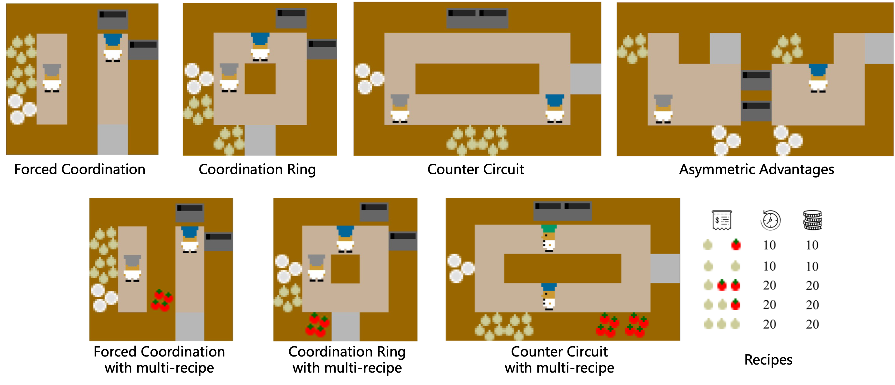
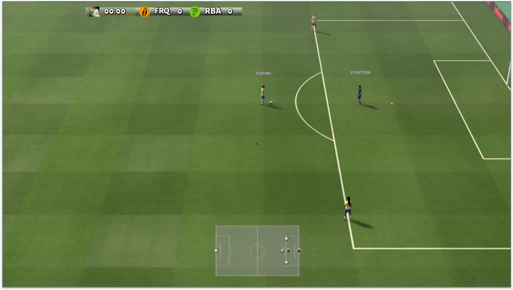

# Social World Model for Zero-Shot Coordination

This repository is the official implementation of **Social World Model for Zero-Shot Coordination**.


### 🧑‍🍳 Overcooked

[Overcooked](https://github.com/HumanCompatibleAI/overcooked_ai) is a simulation environment for reinforcement learning derived from the Overcooked! video game and popular for coordination problems.

Following ZSC-Eval, we evaluate our algorithm in the following layouts:

<div align=center>

</div>

### ⚽️ Google Research Football

[Google Research Football (GRF)](https://github.com/google-research/football) is a simulation environment for reinforcement learning based on the popular football video game.

Following ZSC-Eval, we select the "Academy 3v1 with Keeper" scenario for SWM evaluation:

<div align=center>

</div>


## 📖 Installation
1. Clone the ZSC-Eval benchmark repository:
```shell
git clone https://github.com/sjtu-marl/ZSC-Eval.git
# clone this repo and put files in respective directory.
```
2.	Clone this repo and copy its contents into the corresponding folders of ZSC-Eval.
3.	Create and activate the Conda environment for Overcooked and ZSC-Eval:
```shell
cd ZSC-Eval
conda env create -f environment.yml
conda activate zsceval
```
4. Install Google Research Football:
```shell
./install_grf.sh
```

## 🎯 Training

### 1. Download Pre-trained Models
```bash
cd ZSC-Eval
git clone https://huggingface.co/Leoxxxxh/ZSC-Eval-policy_pool policy_pool
```

### 2. Generate Policy Configs

generate SWM policy_config for each layout
```shell
cd scripts/overcooked # scripts/grf
bash shell/store_config.sh {layout}
```
### 3. Create Training YMLs
```shell
cd ../prep
# k=6 s=5 S=12  Overcooked
# k=6 s=3 S=9   GRF
python gen_dreamer_ymls.py \
  -l ${layout} \
  -k ${num_bias_agents} \
  -s ${stage1_pop_size} \
  -S ${population_size}
```
### 4. Start Training
```shell
cd ../overcooked
bash shell/train_dreamer.sh ${layout} ${population_size}
```

## 📝 Evaluation
We follow the evaluation pipeline of the ZSC-Eval benchmark.
### 1. Generate Evaluation Policies
```shell
python prep/gen_bias_agent_benchmark_yml.py -l {layout}
```
### 2. Start Evaluation
```shell
bash shell/eval_with_bias_agents_wm.sh {layout}
```

### 3. Compute final results
```shell
cd ..
python eval/extract_results.py -a {algo} -l {layout}
```


## 🙏 Acknowledgements
We would like to thank the [ZSC-Eval](https://github.com/sjtu-marl/ZSC-Eval) team for providing a unified benchmark and a suite of pretrained models, which significantly accelerated our development process.  
We also thank the [Ray](https://github.com/ray-project/ray) team for their implementation of DreamerV3, which our code is based upon.